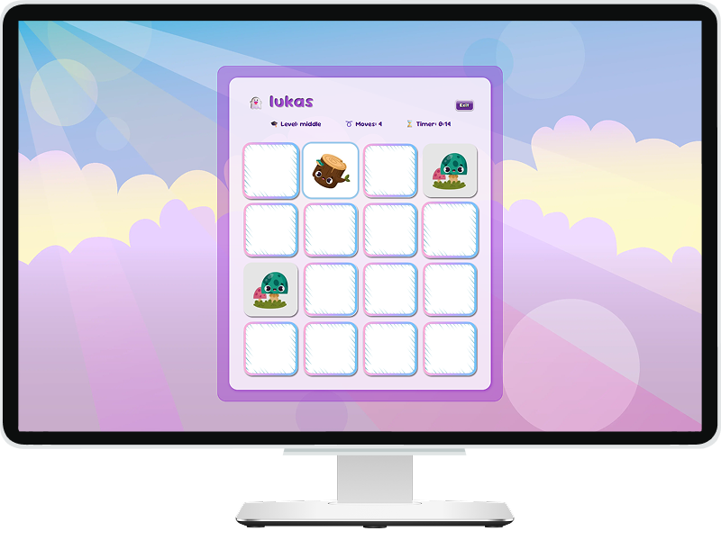

# Project name: 🃏 Memory (card game)

### Project Goal:

Create an accessible, interactive memory game using React.

[](preview.png)

### 💎 Features:

- Developed using **React + Vite**.
- The game supports multiple difficulty levels with different grid sizes.

**User Profiles:**

- Players can create a profile by entering a name and selecting an avatar.
- No authentication (passwords) is required.
- User data is stored in localStorage, allowing results to be saved.

**Score and Ranking System:**

- A timer and moves counter are used to track performance.
- The game tracks the best results first based on number of moves and then on time used to finish
  game.
- A ranking system displays the highest score for each level.

---

### [**Program flow:** excalidraw schema](https://excalidraw.com/#json=PkRrgr1gOpsz-5kqRSaV-,zhjlJ0M2SoKqgAYytcwtLQ)

### 🧩 Tech Stack


<details style="border:1px solid #d4d4d4; border-radius:2px; padding:1rem;">
<summary><h4 style="display:inline; padding-left:6px;">Dependencies:</h4></summary>

```bash
@trivago/prettier-plugin-sort-imports prettier
npm install react-router-dom
npm i clsx
npm install framer-motion
npm install prop-types
npm i zustand
npm install react-helmet-async
```

</details>

<br />

---

### ToDo:

- [ ] ? project structure

<details style="border:1px solid #d4d4d4; border-radius:2px; padding:1rem;">
<summary><h4 style="display:inline; padding-left:6px;">✅ Done:</h4></summary>

- [x] Capital letter on Rating Page for level's name
- [x] icons: emoji+cup
- [x] bug with messages at the end of game + new score
- [x] reset Rating + localStorage
- [x] fetch errors
- [x] fix levels order on RatingPage
- [x] loader
- [x] convert images
- [x] meta description
- [x] fonts
</details>
